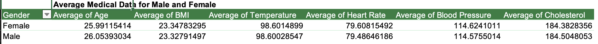
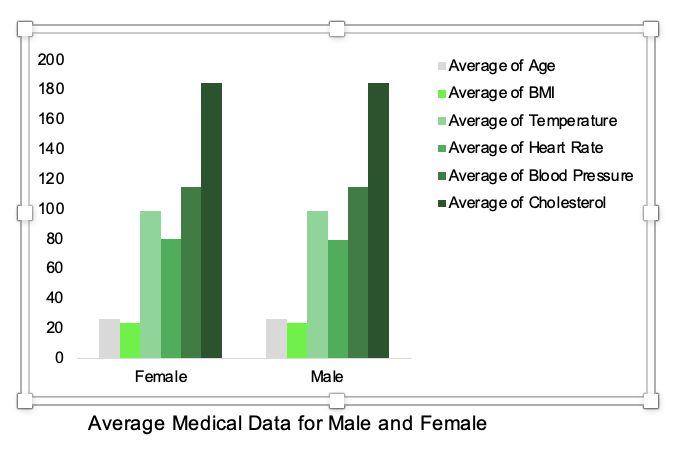
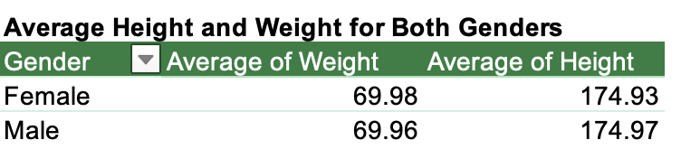
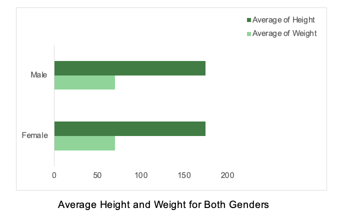
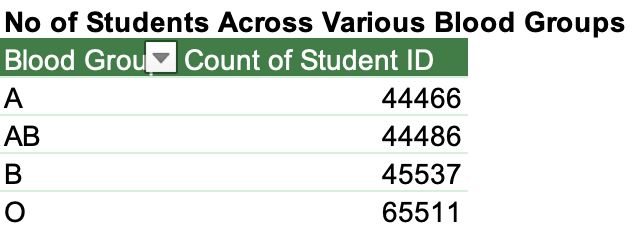
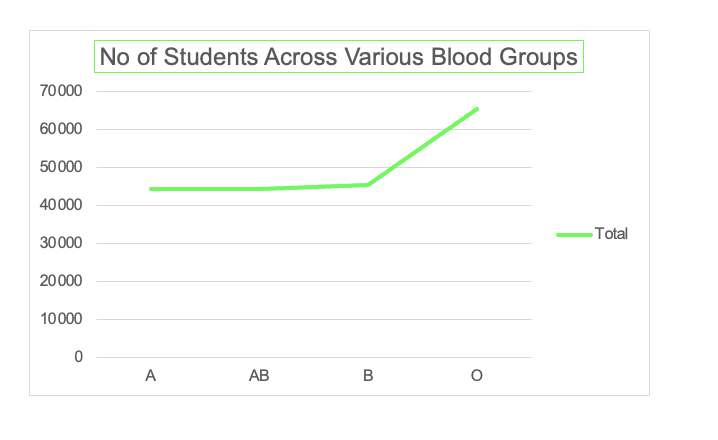
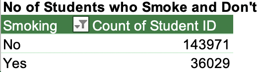
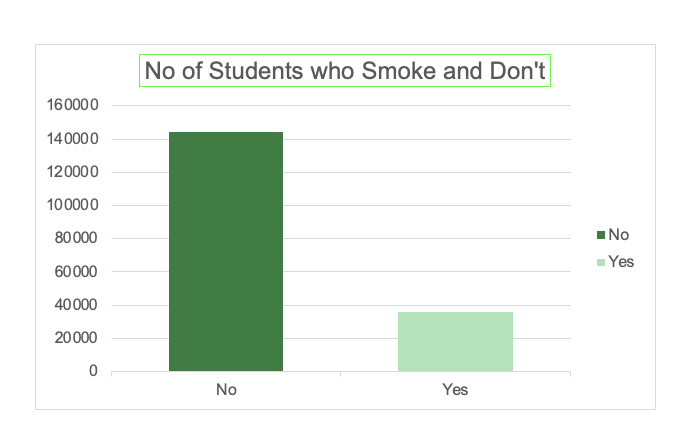
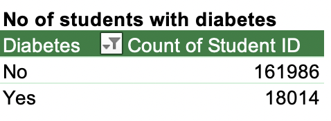
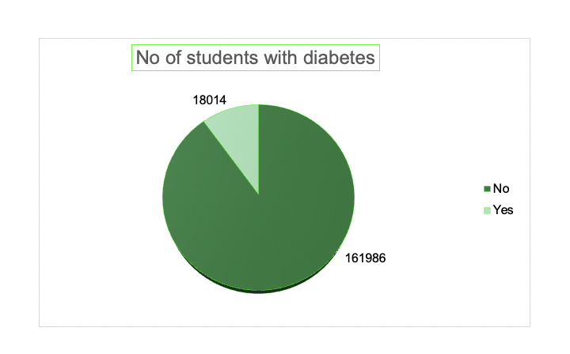

#### Student-Medical-Data-Analysis

## Introduction 
This data set comprises student's medical information. The information includes the student's age, height, weight, blood type, BMI, temperature, heart rate, blood pressure, etc. With the following information, I provided a detailed analysis and derived insight to answer crucial questions for the institution. 

## Question 1 
What are the average values for the following for Males and Females (Age, BMI, Temperature, Heart Rate, Blood Pressure, and Cholesterol)?
Using the pivot table to analyze, I realized that males and females have similar averages across the various data. Something to point out is that although they are similar, the female students had a lower average age and cholesterol. Still, they had a higher average BMI, temperature, heart rate and blood pressure than their male counterparts. 

To further visualize this data,  I used the 2-D column to show the similarities between the male and female averages, as documented below.  

## Question 2 
What is the average Height and Weight for both Genders?

The  average height for the male students is 174.97, and their average weight is 69.96. On the other hand, the average height for female students is 174.93, And their average weight is 69.98. Looking at the column clearly shows the similarity between both genders; however, even though the average height of the male students is higher, the female students have a higher average weight  than the male students. To visualize the average height and weight for males and females, I used the 2-D bar, and both males and females have  similar weights and height averages.

 

## Question 3 
What is the number of students across the different Blood Groups

From the analysis above, 44,466 students in the A blood group,44,486 students in the AB blood group, 45,537 students in the B blood group and the O blood group have the highest number of students at 65,511. 

I used a 2-D line diagram to analyze it further to show the difference between the various blood groups. It shows that about 65,000+ students have the O blood group. In contrast, the other blood group is levelled at about 44000+ per blood group. 

 

## Question 4 
What is the number of students who smoke and those who don’t

In this institution, we can say that about 18% of students are smokers, and the other 81.99% are not. 

The 3D column below helps us visualize that data as we can see about 14,000+ students are smokers and 35,000+ are non-smokers. 

## Question 5 

What is the number of Students who have diabetes and those who don’t

 

The table above shows 18014 diabetic students and 161986 non-diabetic students.

I used the pie chart to visualize the data of diabetic and non-diabetic students. 

 

